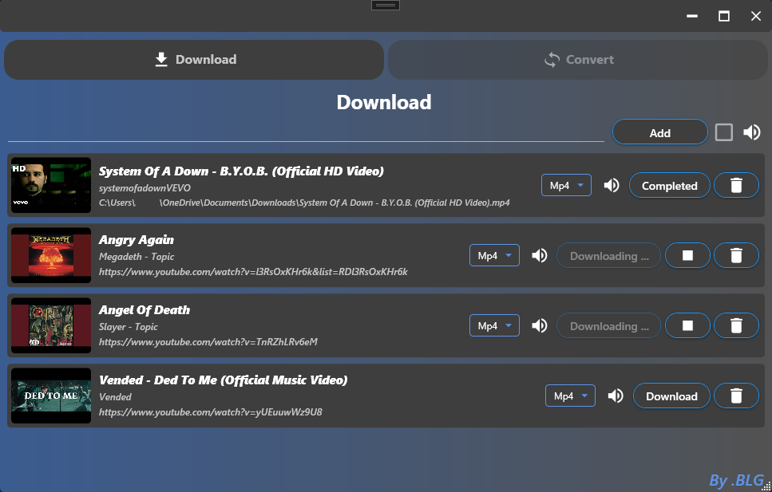
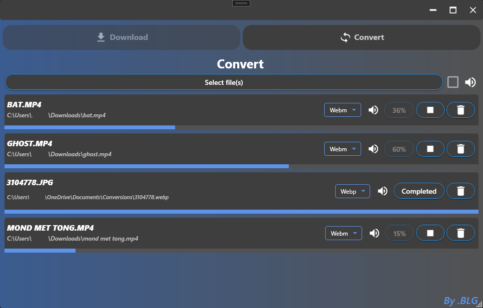

# YouTube Video Downloader & File Converter

This project is a YouTube video downloader and file converter app built in .NET 8. The application provides an easy way to download YouTube videos and convert files to various formats.

This project was born out of a need for a simple and efficient tool to download and convert media assets for use in creative projects and modding tools for games like The Sims, Planet Zoo, and Planet Coaster. While there are many tools out there, few offered the flexibility and control needed in a single, easy-to-use application.

## Features

### YouTube Video Downloader:
- **Download YouTube videos** via the video URL.
- Available in the following formats:
  - `.webm`
  - `.mp4`
  - `.mp3`
- **Download videos without audio**.
- Uses the [yt-dlp](https://github.com/yt-dlp/yt-dlp) command-line tool.
- **yt-dlp is downloaded automatically** when the application runs.
- Downloads wil be stored in C:\Users\USER\Documents\Downloads

### File Converter:
- **Upload files** and convert them to a desired file type (format).
- Supports conversions such as:
  - Video to audio (e.g., .mp4 to .mp3).
  - Remove audio from videos.
- Uses [FFmpeg](https://ffmpeg.org/) under the hood.
- **FFmpeg is also downloaded automatically** when the application runs.
- Converted files wil be stored in C:\Users\USER\Documents\Conversions

### Demo App:
A demo executable (exe) is available that you can use to try out the program locally. The demo app offers a user-friendly interface for both downloading YouTube videos and converting files.

## Requirements

- .NET 8 (or higher) installed.
- No need to manually install yt-dlp or FFmpeg — the application will download them automatically when needed.

## Installation

1. Clone the repository to your local machine:

   ```bash
   git clone https://github.com/BLG2/Downloader.git
   ```

2. Navigate to the project directory:

   ```bash
   cd Downloader
   ```

3. Install the required dependencies:

   ```bash
   dotnet restore
   ```

4. Build and run the application:

   ```bash
   dotnet run
   ```

5. You can also run the included demo executable.

## Usage

### YouTube Video Downloader
1. Open the application.
2. Enter the URL of the YouTube video you want to download.
3. Choose the desired format (`.webm`, `.mp4`, or `.mp3`).
4. Click "Download" to save the video.

### File Converter
1. Select the files you want to convert.
2. Choose the desired output format.
3. Click "Convert" to process the file.

## License

This project is licensed under the MIT License - see the [LICENSE](LICENSE.txt) file for details.

## Contact


### Demo App
You can use the demo application without compiling the source code. Download the [Downloader Demo](Downloader/DemoApp/Downloader%20Demo) to test the features.


